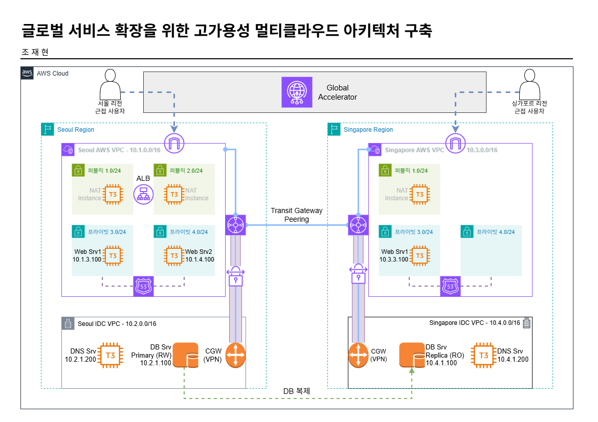

# AWS Hybrid Multi-Region DR Architecture (IaC)

> **CloudFormation**을 활용하여 **AWS 멀티 리전(Seoul & Singapore)**과 **온프레미스 가상 IDC** 간에 사설 네트워크를 연결하고, **Active-Passive 데이터 복제 및 글로벌 트래픽 Failover**를 구현한 하이브리드 재해 복구(DR) 인프라 프로젝트입니다.

---

## 🏗️ 시스템 아키텍처 (System Architecture)



---

## 🌟 핵심 아키텍처 설계 포인트 (Key Features)

### 1. 글로벌 하이브리드 사설 네트워킹 (Hybrid Networking)
* **AWS 리전 간 연결:** **AWS Transit Gateway (TGW) Peering**을 서울-싱가포르 리전 사이에 연결하여 리전 간 내부 사설 대역 통신망 구축.
* **하이브리드 사설 통신:** 각 리전의 가상 IDC(Rocky Linux 기반 CGW)와 AWS VPC 간을 **IPsec VPN(Customer Gateway + TGW Connection)**으로 터널링하여 암호화된 전용 사설 통신망 형성.
* **이중화 라우팅:** NAT 인스턴스를 활용해 Private Subnet의 아웃바운드 인터넷 경로를 확보하고, TGW를 통해 IDC와 교차 리전 간 복잡한 IP 대역 라우팅을 체계적으로 설계.

### 2. 하이브리드 사설 DNS 연동 (BIND DNS Forwarding)
* IDC 내부에 **Rocky Linux 기반 BIND DNS (`named`)** 서버를 구축하여 사설 도메인 존(`idcseoul.internal`, `idcsingapore.internal`)을 운영.
* **DNS Forwarding:** AWS VPC의 Route 53 Private Hosted Zone과 IDC DNS 간 포워더 설정을 연동하여, 하이브리드 망 전역에서 상대 영역의 내부 도메인 주소(FQDN)를 완벽하게 상호 해석(Name Resolution)할 수 있도록 구현.

### 3. 리전 간 사설 데이터 동기화 (MySQL Cross-Region Replication)
* 서울 IDC의 MySQL (Master)과 싱가포르 IDC의 MySQL (Slave) 간에 **실시간 MySQL DB 복제(Replication)** 구성.
* 복제 트래픽은 인터넷이 아닌 VPN 사설 터널링(TGW)을 경유하도록 통제하여 안전한 데이터 정합성 보장.

### 4. 글로벌 트래픽 라우팅 & Failover (Global Accelerator)
* **AWS Global Accelerator (GA)**를 최상단에 배치하여 글로벌 단일 엔드포인트 제공.
* 트래픽 다이얼(Traffic Dial) 및 가중치 설정을 통해 서울 ALB와 싱가포르 EC2 웹서버로의 부하를 유기적으로 제어하며 리전 수준의 자동/수동 장애 조치(Failover) 아키텍처 실현.

---

## 📁 디렉토리 구조 (Directory Structure)

```
aws-hybrid-multi-region-dr/
├── README.md                 # 프로젝트 아키텍처 및 상세 설명
├── templates/
│   ├── project_Seoul.yaml     # 서울 리전 인프라 (AWS VPC, 가상 IDC, TGW, VPN, EC2, ALB)
│   ├── project_Singapore.yaml # 싱가포르 리전 인프라 (AWS VPC, 가상 IDC, TGW, VPN, EC2)
│   └── GA.yaml               # 글로벌 로드밸런싱 (AWS Global Accelerator)
├── src/
│   ├── seoul/                # 서울 웹 서버 구동용 PHP 웹 어플리케이션 소스
│   └── singapore/            # 싱가포르 웹 서버 구동용 PHP 웹 어플리케이션 소스
└── scripts/
    ├── seoul/
    │   ├── setup_dns.sh      # 서울 IDC BIND DNS 서버 자동 구축 스크립트
    │   ├── db_master.sh      # 서울 IDC MySQL 마스터 DB 설정 스크립트
    │   └── vpn_seoul.sh      # 서울 IDC VPN 연결 확인 및 라우팅 디버그 스크립트
    └── singapore/
        ├── db_slave.sh       # 싱가포르 IDC MySQL 슬레이브 DB 복제 연결 설정 스크립트
        └── vpn_Singapore.sh  # 싱가포르 IDC VPN 라우팅 제어 스크립트
```

---

## 🚀 배포 및 시나리오 검증 가이드 (Deployment Guide)

### 1단계: 리전별 인프라 배포 (CloudFormation)
1. **서울 리전 템플릿 배포:** `templates/project_Seoul.yaml`을 서울 리전(`ap-northeast-2`) CloudFormation 콘솔에 업로드하여 스택 생성.
2. **싱가포르 리전 템플릿 배포:** `templates/project_Singapore.yaml`을 싱가포르 리전(`ap-southeast-1`)에 업로드하여 스택 생성.

### 2단계: 글로벌 트래픽 분산 구성 (Global Accelerator)
1. `templates/GA.yaml` 스택을 실행하여 Global Accelerator를 배포합니다.
2. 파라미터에 각 리전의 ALB ARN과 EC2 Instance ID를 주입하여 트래픽 엔드포인트를 연결합니다.

### 3단계: 사설 DNS 및 DB 복제 셋팅
1. 서울 IDC 가상 서버에 접속하여 `/scripts/seoul/setup_dns.sh` 스크립트를 실행해 BIND DNS 서비스를 기동합니다.
2. 마스터(서울)와 슬레이브(싱가포르) DB 서버에서 각각 `db_master.sh` 및 `db_slave.sh` 스크립트를 실행해 사설 VPN 터널을 통한 복제 동기화를 완성합니다.
3. 서울 AWS 웹 서버(`index.php`)에 접근하여 가상 IDC 데이터베이스 동기화 상태 및 연결 성공 메시지를 검증합니다.

---

## 📝 프로젝트 수행 소감 & 성장 포인트 (Key Takeaway)

* **선언형 인프라 관리의 가치 습득:** 콘솔 조작으로 수 시간 걸리던 복잡한 멀티 리전 VPN 및 가상 IDC 네트워크 망 구축 작업을 **CloudFormation 코드로 템플릿화**하여 재배포가 용이한 멱등성 인프라를 달성했습니다.
* **하이브리드 네트워킹 심층 연구:** AWS Transit Gateway, VPN, 그리고 사설 DNS 포워딩을 구현하면서 클라우드가 독립된 네트워크가 아니라 온프레미스 인프라와 유기적으로 소통하기 위한 라우팅 및 호스트명 해석(DNS) 설계의 중요성을 체득했습니다.
